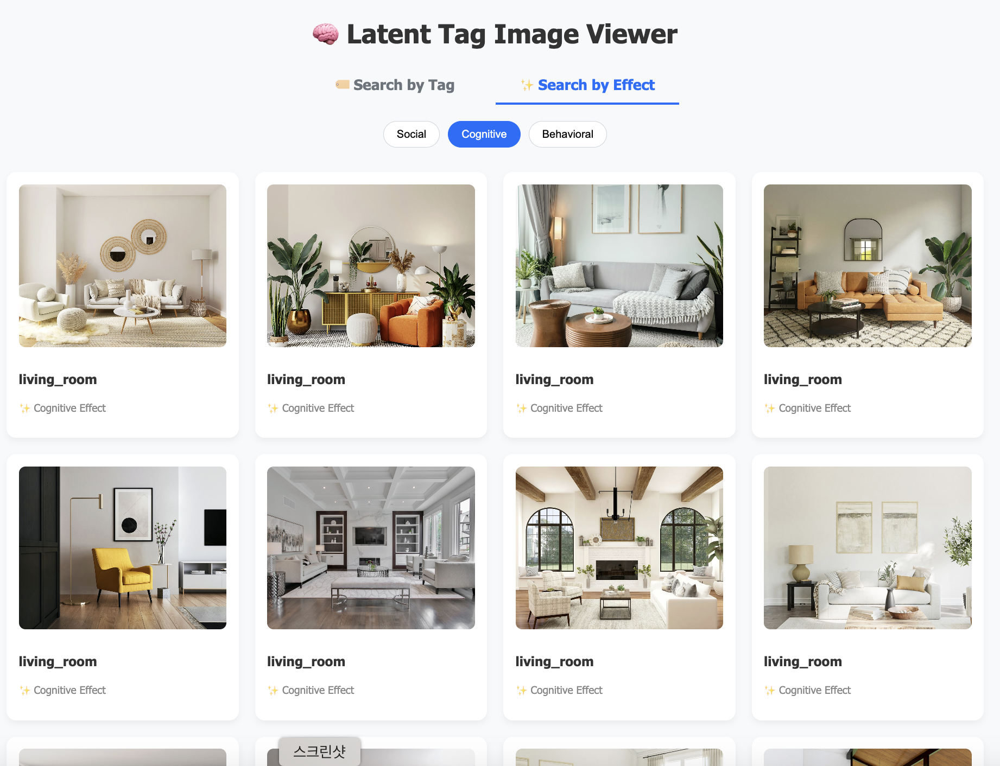
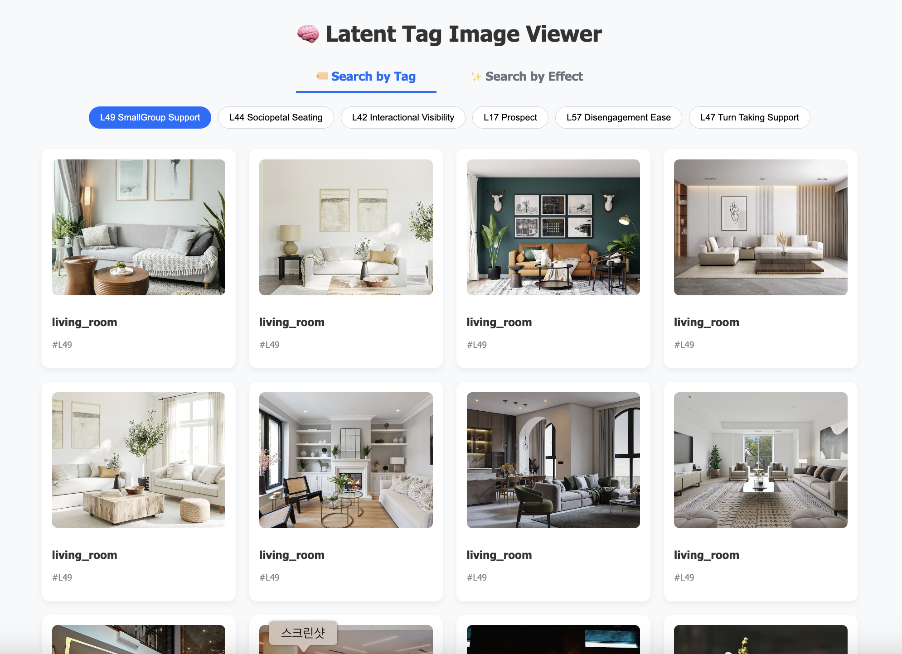
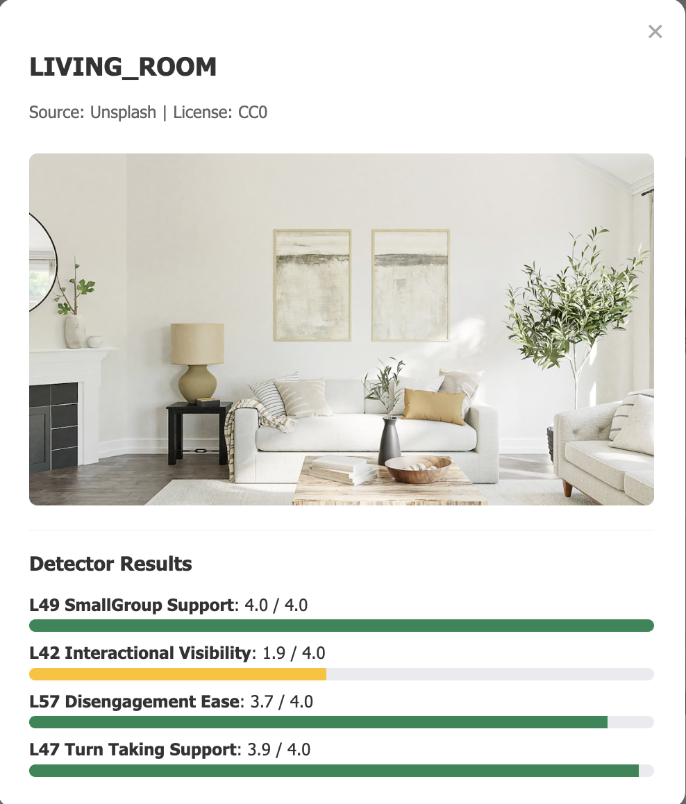
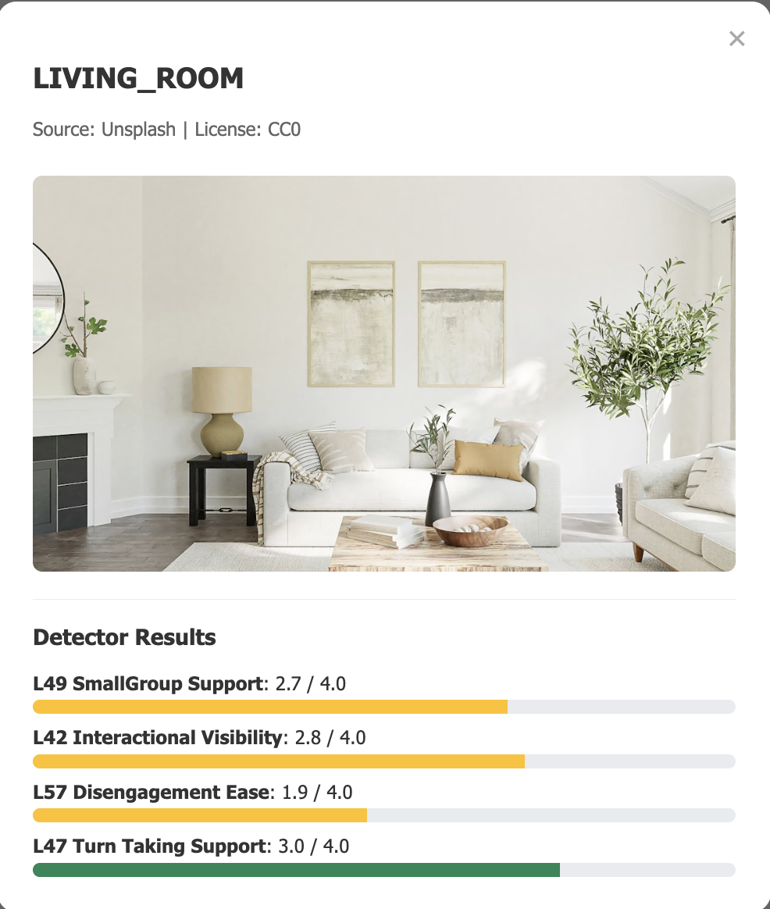

# 🧠 Knowledge Atlas - Track 1: Image Tagger


An automated data pipeline and interactive web viewer designed to analyze the geometric properties of spatial environments and visualize their impact on human cognitive and social behaviors. This repository showcases the full data lifecycle—from automated collection and strict validation to algorithmic spatial analysis and frontend UI visualization.

**Author:** Hyojeong Lee (B.S. Cognitive Science w/ Machine Learning & Neuroscience, UC San Diego)

---

## 💡 Key Features

### 1. Zero-dependency Web Viewer (Phase 3)
A lightweight, standalone frontend web viewer (`ka_image_viewer.html`) built entirely with HTML/JS, requiring no backend servers or heavy UI frameworks.

**✨ Search by Effect & Tag Mode**
Users can filter and browse spatial environments not just by physical tags, but by their 'Social' and 'Cognitive' effects on human behavior.



**🔍 Interactive Detail Modal**
Displays validation provenance and visual proportional score bars based on detector results, with dynamic color mapping.



### 2. Automated Image Collection (Phase 1)
- Developed a robust Python script utilizing the **Unsplash API** to collect over 1,200 image metadata records across 15 distinct interior space categories.
- Implemented API rate-limiting handling and strict JSON schema validation logic to ensure data integrity.

### 3. Latent Tag Detectors (Phase 2)
- Built 6 spatial feature detectors using **pure Numpy and geometric/mathematical algorithms**, completely bypassing the need for heavy ML frameworks.
- **Family A (Furniture Geometry):** Utilized vector dot products to detect Sociopetal Seating (face-to-face arrangements).
- **Family B (Visual Access):** Applied Bresenham's Line Algorithm to calculate Interactional Visibility and Prospect within a space.
- **Family C (Circulation):** Analyzed Disengagement Ease via independent exit paths using Breadth-First Search (BFS) algorithms.
- **Test-Driven Development (TDD):** Authored over 30 robust test cases using `pytest` to prevent edge-case failures.

---

## 🛠 Tech Stack

| Category | Technology |
| :--- | :--- |
| **Language** | Python, JavaScript, HTML5/CSS3 |
| **Libraries** | Numpy, Pillow (PIL), Pytest |
| **Architecture**| Zero-dependency Frontend, Test-Driven Development, Batch Processing |
| **API** | Unsplash Developer API |

---

## 🚀 How to Run (Local)

Due to browser CORS policies for local files, a local HTTP server must be used to fully experience the viewer and load the JSON datasets.

**1. Clone the repository**
```bash
git clone https://github.com/your-username/Knowledge_Atlas.git
cd Knowledge_Atlas
```

**2. Start a local Python server**
```bash
python -m http.server 8000
```

**3. Open the viewer in your browser**
👉 `http://localhost:8000/track1/hyojeong/src/ka_image_viewer.html`
